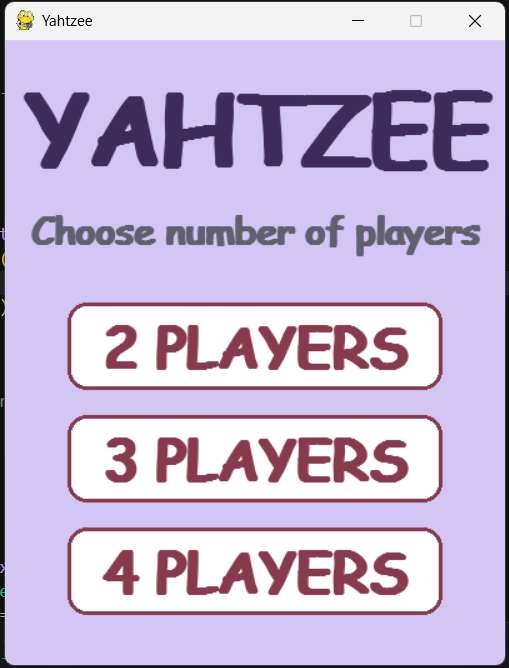
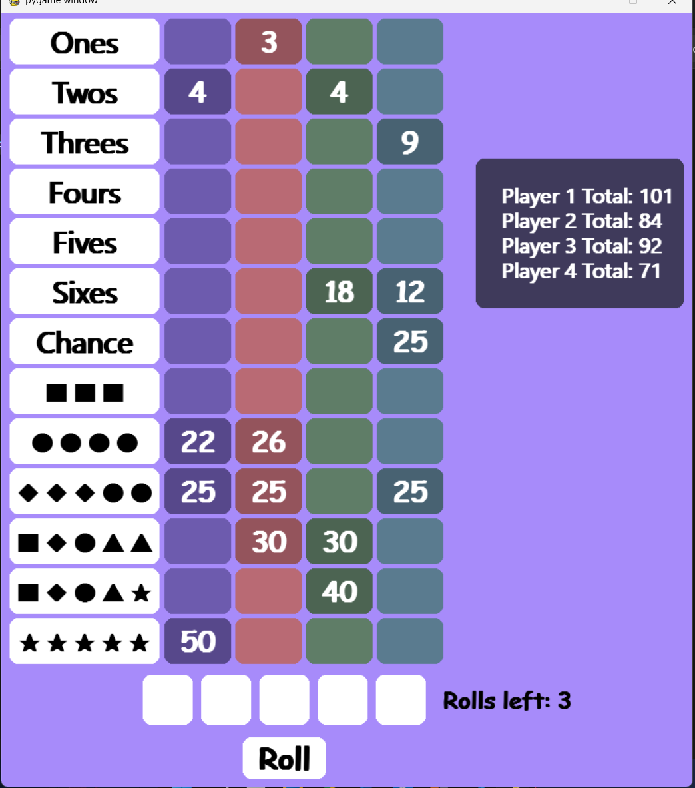

# PyYahtzee 🎲

A desktop implementation of the classic Yahtzee dice game built using Python and Pygame.

---

## ✨ Features

- 2–4 player support
- Interactive dice with hold functionality
- Complete Yahtzee scoring system
- Upper Section Bonus
- Yahtzee Bonus
- Joker Rule implementation
- Automatic score calculation
- Winner detection
- Custom GUI widgets
- Modern pastel-themed interface

---

## 🕹️ How to Play

- Click **Roll Dice** to roll the dice.
- Click a die to hold or release it.
- You may roll up to **three times** each turn.
- Click one of the score categories to record your score.
- The game continues until every category has been filled.
- The player with the highest total score wins!

---

## 📥 Installation

```bash
# Clone the repository
git clone https://github.com/Dishen192/PyYahtzee
```

```bash
# Install the required dependencies
pip install pygame
```

---

## 🚀 Run

```bash
python main.py
```

---

## ⚙️ Technologies Used

- Python
- Pygame

---

## 📌 Future Plans

- Dice rolling animations
- Sound effects
- Winner celebration animation
- Restart game option
- Settings menu
- Mobile (Android) version

---

## 📸 Screenshots

### 🏠 Main Menu


### 🎲 Gameplay


---


## 🤝 Contributing

Contributions are welcome! Feel free to open issues or submit pull requests to improve the project.

---

## 👨🏽‍💻 Author

**Dishen Bharadwaj R**

---

## 📋 License

PyYahtzee is released under the [MIT LICENSE](https://github.com/Dishen192/PyYahtzee/blob/main/LICENSE).
